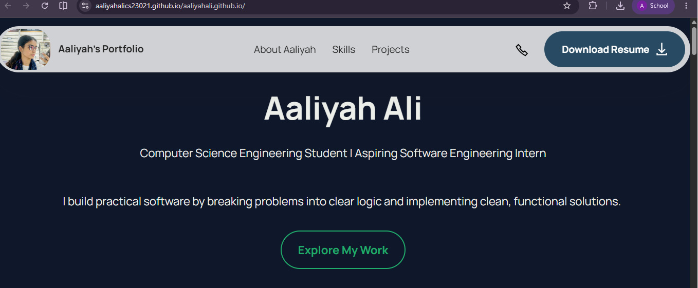
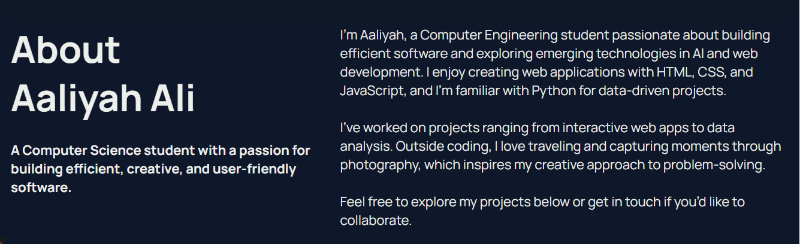
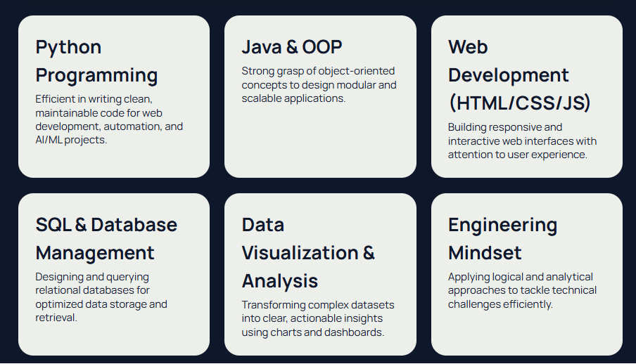
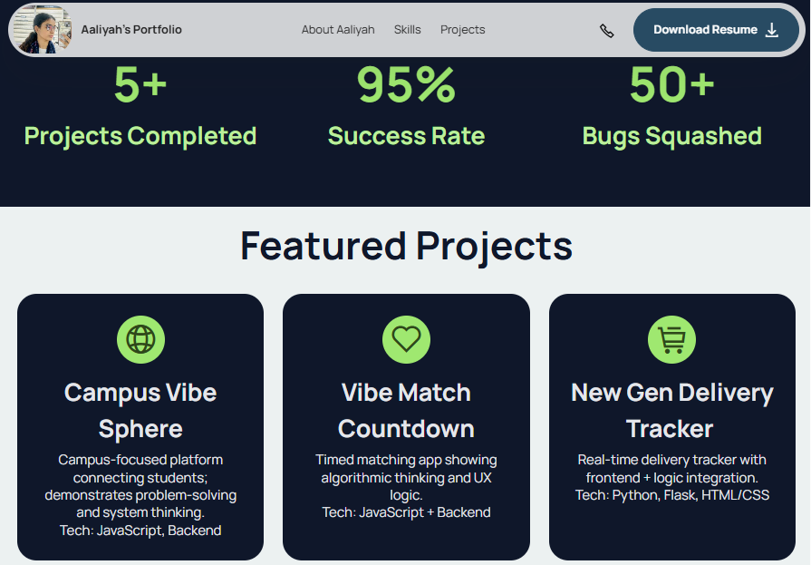
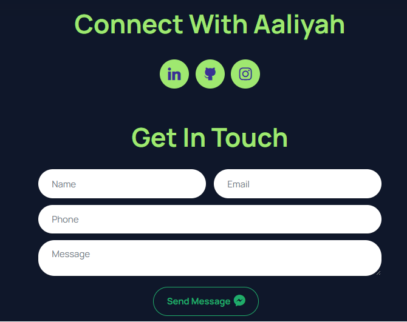

# 🌐 Personal Portfolio Website

A responsive personal portfolio showcasing my skills, projects, education, achievements, and technical experience as a Computer Science Engineering student. The website serves as a central hub for recruiters and collaborators to explore my work, resume, and contact information.

🌍 **Live Website:** https://aaliyahalics23021.github.io/aaliyahali.github.io/

---

## ✨ Features

- 👩 About Me section
- 💻 Technical Skills
- 🚀 Featured Projects
- 🎓 Education & Achievements
- 📄 Resume Download
- 📱 Fully Responsive Design
- 📬 Contact Information
- 🔗 GitHub & Social Links

---

## 📸 Screenshots

### 🏠 Home

---

### 👩 About

---

### 💻 Skills

---

### 🚀 Projects

---

### 📬 Connect

---

## 🛠 Tech Stack

- HTML5
- CSS3
- JavaScript
- Bootstrap
- Git & GitHub
- GitHub Pages

---

## 🚀 Highlights

- Responsive portfolio website
- Showcases technical skills and projects
- Downloadable resume
- Easy navigation
- Professional UI/UX
- Optimized for desktop and mobile

---

## 📂 Featured Projects

- 🧬 Exam Seating Arrangement Using Genetic Algorithm
- 🔐 User Login Behavior Analysis & Risk Detection System
- 🚚 Delivery Tracker Management System
- 📖 Daily Journal Tracker

---

## 📌 Purpose

This portfolio was created to showcase my academic projects, technical expertise, and achievements while providing recruiters and collaborators with a centralized platform to learn more about my work.

---

## 🌐 Live Demo

**Portfolio:** https://aaliyahalics23021.github.io/aaliyahali.github.io/
